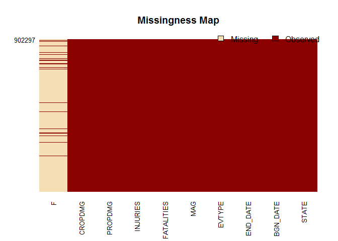
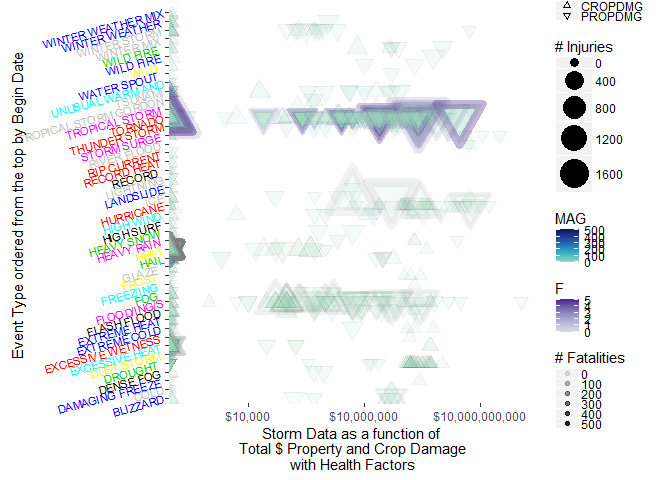

    ## [1] "Fri Feb 05 09:04:58 2016"

Data Processing: Load Data via *"ProjectTemplate"*
--------------------------------------------------

    > ldData <- process.loadData()

    Loading project configuration

    Autoloading helper functions

     Running helper script: controllerGeneratorHelp.R

     Running helper script: helpers.R

     Running helper script: modelGeneratorHelp.R

     Running helper script: viewGeneratorHelp.R

    Autoloading packages

     Loading package: reshape

     Loading package: plyr

     Loading package: ggplot2

     Loading package: stringr

     Loading package: lubridate

     Loading package: dplyr

     Loading package: graphics

     Loading package: rmarkdown

     Loading package: knitr

     Loading package: reshape2

     Loading package: Amelia

     Loading package: xtable

     Loading package: RColorBrewer

     Loading package: scales

     Loading package: outliers

     Loading package: tidyr

    Autoloading cache

    Autoloading data

    Converting data.frames to data.tables

    Munging data

     Running preprocessing script: 00-modelQueryHelp.R

     Running preprocessing script: 00-transformationsHelp.R

     Running preprocessing script: 01-A.R

     Running preprocessing script: 10-plotViewHelp.R

    $repdata_data_StormData.csv.bz2
    $repdata_data_StormData.csv.bz2$tag
    [1] "Summary"

    $repdata_data_StormData.csv.bz2$out
        STATE__                  BGN_DATE             BGN_TIME     
     Min.   : 1.0   5/25/2011 0:00:00:  1202   12:00:00 AM: 10163  
     1st Qu.:19.0   4/27/2011 0:00:00:  1193   06:00:00 PM:  7350  
     Median :30.0   6/9/2011 0:00:00 :  1030   04:00:00 PM:  7261  
     Mean   :31.2   5/30/2004 0:00:00:  1016   05:00:00 PM:  6891  
     3rd Qu.:45.0   4/4/2011 0:00:00 :  1009   12:00:00 PM:  6703  
     Max.   :95.0   4/2/2006 0:00:00 :   981   03:00:00 PM:  6700  
                    (Other)          :895866   (Other)    :857229  
       TIME_ZONE          COUNTY           COUNTYNAME         STATE       
     CST    :547493   Min.   :  0.0   JEFFERSON :  7840   TX     : 83728  
     EST    :245558   1st Qu.: 31.0   WASHINGTON:  7603   KS     : 53440  
     MST    : 68390   Median : 75.0   JACKSON   :  6660   OK     : 46802  
     PST    : 28302   Mean   :100.6   FRANKLIN  :  6256   MO     : 35648  
     AST    :  6360   3rd Qu.:131.0   LINCOLN   :  5937   IA     : 31069  
     HST    :  2563   Max.   :873.0   MADISON   :  5632   NE     : 30271  
     (Other):  3631                   (Other)   :862369   (Other):621339  
                   EVTYPE         BGN_RANGE           BGN_AZI      
     HAIL             :288661   Min.   :   0.000          :547332  
     TSTM WIND        :219940   1st Qu.:   0.000   N      : 86752  
     THUNDERSTORM WIND: 82563   Median :   0.000   W      : 38446  
     TORNADO          : 60652   Mean   :   1.484   S      : 37558  
     FLASH FLOOD      : 54277   3rd Qu.:   1.000   E      : 33178  
     FLOOD            : 25326   Max.   :3749.000   NW     : 24041  
     (Other)          :170878                      (Other):134990  
             BGN_LOCATI                  END_DATE             END_TIME     
                  :287743                    :243411              :238978  
     COUNTYWIDE   : 19680   4/27/2011 0:00:00:  1214   06:00:00 PM:  9802  
     Countywide   :   993   5/25/2011 0:00:00:  1196   05:00:00 PM:  8314  
     SPRINGFIELD  :   843   6/9/2011 0:00:00 :  1021   04:00:00 PM:  8104  
     SOUTH PORTION:   810   4/4/2011 0:00:00 :  1007   12:00:00 PM:  7483  
     NORTH PORTION:   784   5/30/2004 0:00:00:   998   11:59:00 PM:  7184  
     (Other)      :591444   (Other)          :653450   (Other)    :622432  
       COUNTY_END COUNTYENDN       END_RANGE           END_AZI      
     Min.   :0    Mode:logical   Min.   :  0.0000          :724837  
     1st Qu.:0    NA's:902297    1st Qu.:  0.0000   N      : 28082  
     Median :0                   Median :  0.0000   S      : 22510  
     Mean   :0                   Mean   :  0.9862   W      : 20119  
     3rd Qu.:0                   3rd Qu.:  0.0000   E      : 20047  
     Max.   :0                   Max.   :925.0000   NE     : 14606  
                                                    (Other): 72096  
               END_LOCATI         LENGTH              WIDTH         
                    :499225   Min.   :   0.0000   Min.   :   0.000  
     COUNTYWIDE     : 19731   1st Qu.:   0.0000   1st Qu.:   0.000  
     SOUTH PORTION  :   833   Median :   0.0000   Median :   0.000  
     NORTH PORTION  :   780   Mean   :   0.2301   Mean   :   7.503  
     CENTRAL PORTION:   617   3rd Qu.:   0.0000   3rd Qu.:   0.000  
     SPRINGFIELD    :   575   Max.   :2315.0000   Max.   :4400.000  
     (Other)        :380536                                         
           F               MAG            FATALITIES          INJURIES        
     Min.   :0.0      Min.   :    0.0   Min.   :  0.0000   Min.   :   0.0000  
     1st Qu.:0.0      1st Qu.:    0.0   1st Qu.:  0.0000   1st Qu.:   0.0000  
     Median :1.0      Median :   50.0   Median :  0.0000   Median :   0.0000  
     Mean   :0.9      Mean   :   46.9   Mean   :  0.0168   Mean   :   0.1557  
     3rd Qu.:1.0      3rd Qu.:   75.0   3rd Qu.:  0.0000   3rd Qu.:   0.0000  
     Max.   :5.0      Max.   :22000.0   Max.   :583.0000   Max.   :1700.0000  
     NA's   :843563                                                           
        PROPDMG          PROPDMGEXP        CROPDMG          CROPDMGEXP    
     Min.   :   0.00          :465934   Min.   :  0.000          :618413  
     1st Qu.:   0.00   K      :424665   1st Qu.:  0.000   K      :281832  
     Median :   0.00   M      : 11330   Median :  0.000   M      :  1994  
     Mean   :  12.06   0      :   216   Mean   :  1.527   k      :    21  
     3rd Qu.:   0.50   B      :    40   3rd Qu.:  0.000   0      :    19  
     Max.   :5000.00   5      :    28   Max.   :990.000   B      :     9  
                       (Other):    84                     (Other):     9  
          WFO                                       STATEOFFIC    
            :142069                                      :248769  
     OUN    : 17393   TEXAS, North                       : 12193  
     JAN    : 13889   ARKANSAS, Central and North Central: 11738  
     LWX    : 13174   IOWA, Central                      : 11345  
     PHI    : 12551   KANSAS, Southwest                  : 11212  
     TSA    : 12483   GEORGIA, North and Central         : 11120  
     (Other):690738   (Other)                            :595920  
                                                                                                                                                                                                        ZONENAMES     
                                                                                                                                                                                                             :594029  
                                                                                                                                                                                                             :205988  
     GREATER RENO / CARSON CITY / M - GREATER RENO / CARSON CITY / M                                                                                                                                         :   639  
     GREATER LAKE TAHOE AREA - GREATER LAKE TAHOE AREA                                                                                                                                                       :   592  
     JEFFERSON - JEFFERSON                                                                                                                                                                                   :   303  
     MADISON - MADISON                                                                                                                                                                                       :   302  
     (Other)                                                                                                                                                                                                 :100444  
        LATITUDE      LONGITUDE        LATITUDE_E     LONGITUDE_    
     Min.   :   0   Min.   :-14451   Min.   :   0   Min.   :-14455  
     1st Qu.:2802   1st Qu.:  7247   1st Qu.:   0   1st Qu.:     0  
     Median :3540   Median :  8707   Median :   0   Median :     0  
     Mean   :2875   Mean   :  6940   Mean   :1452   Mean   :  3509  
     3rd Qu.:4019   3rd Qu.:  9605   3rd Qu.:3549   3rd Qu.:  8735  
     Max.   :9706   Max.   : 17124   Max.   :9706   Max.   :106220  
     NA's   :47                      NA's   :40                     
                                               REMARKS           REFNUM      
                                                   :287433   Min.   :     1  
                                                   : 24013   1st Qu.:225575  
     Trees down.\n                                 :  1110   Median :451149  
     Several trees were blown down.\n              :   568   Mean   :451149  
     Trees were downed.\n                          :   446   3rd Qu.:676723  
     Large trees and power lines were blown down.\n:   432   Max.   :902297  
     (Other)                                       :588295                   

    $repdata_data_StormData.csv.bz2
    $repdata_data_StormData.csv.bz2$tag
    [1] "Structure"

    $repdata_data_StormData.csv.bz2$out
     [1] "Classes 'data.table' and 'data.frame':\t902297 obs. of  37 variables:"                                                                                                                                                     
     [2] " $ STATE__   : num  1 1 1 1 1 1 1 1 1 1 ..."                                                                                                                                                                              
     [3] " $ BGN_DATE  : Factor w/ 16335 levels \"1/1/1966 0:00:00\",..: 6523 6523 4242 11116 2224 2224 2260 383 3980 3980 ..."                                                                                                     
     [4] " $ BGN_TIME  : Factor w/ 3608 levels \"00:00:00 AM\",..: 272 287 2705 1683 2584 3186 242 1683 3186 3186 ..."                                                                                                              
     [5] " $ TIME_ZONE : Factor w/ 22 levels \"ADT\",\"AKS\",\"AST\",..: 7 7 7 7 7 7 7 7 7 7 ..."                                                                                                                                   
     [6] " $ COUNTY    : num  97 3 57 89 43 77 9 123 125 57 ..."                                                                                                                                                                    
     [7] " $ COUNTYNAME: Factor w/ 29601 levels \"\",\"5NM E OF MACKINAC BRIDGE TO PRESQUE ISLE LT MI\",..: 13513 1873 4598 10592 4372 10094 1973 23873 24418 4598 ..."                                                             
     [8] " $ STATE     : Factor w/ 72 levels \"AK\",\"AL\",\"AM\",..: 2 2 2 2 2 2 2 2 2 2 ..."                                                                                                                                      
     [9] " $ EVTYPE    : Factor w/ 985 levels \"   HIGH SURF ADVISORY\",..: 834 834 834 834 834 834 834 834 834 834 ..."                                                                                                            
    [10] " $ BGN_RANGE : num  0 0 0 0 0 0 0 0 0 0 ..."                                                                                                                                                                              
    [11] " $ BGN_AZI   : Factor w/ 35 levels \"\",\"  N\",\" NW\",..: 1 1 1 1 1 1 1 1 1 1 ..."                                                                                                                                      
    [12] " $ BGN_LOCATI: Factor w/ 54429 levels \"\",\"- 1 N Albion\",..: 1 1 1 1 1 1 1 1 1 1 ..."                                                                                                                                  
    [13] " $ END_DATE  : Factor w/ 6663 levels \"\",\"1/1/1993 0:00:00\",..: 1 1 1 1 1 1 1 1 1 1 ..."                                                                                                                               
    [14] " $ END_TIME  : Factor w/ 3647 levels \"\",\" 0900CST\",..: 1 1 1 1 1 1 1 1 1 1 ..."                                                                                                                                       
    [15] " $ COUNTY_END: num  0 0 0 0 0 0 0 0 0 0 ..."                                                                                                                                                                              
    [16] " $ COUNTYENDN: logi  NA NA NA NA NA NA ..."                                                                                                                                                                               
    [17] " $ END_RANGE : num  0 0 0 0 0 0 0 0 0 0 ..."                                                                                                                                                                              
    [18] " $ END_AZI   : Factor w/ 24 levels \"\",\"E\",\"ENE\",\"ESE\",..: 1 1 1 1 1 1 1 1 1 1 ..."                                                                                                                                
    [19] " $ END_LOCATI: Factor w/ 34506 levels \"\",\"- .5 NNW\",..: 1 1 1 1 1 1 1 1 1 1 ..."                                                                                                                                      
    [20] " $ LENGTH    : num  14 2 0.1 0 0 1.5 1.5 0 3.3 2.3 ..."                                                                                                                                                                   
    [21] " $ WIDTH     : num  100 150 123 100 150 177 33 33 100 100 ..."                                                                                                                                                            
    [22] " $ F         : int  3 2 2 2 2 2 2 1 3 3 ..."                                                                                                                                                                              
    [23] " $ MAG       : num  0 0 0 0 0 0 0 0 0 0 ..."                                                                                                                                                                              
    [24] " $ FATALITIES: num  0 0 0 0 0 0 0 0 1 0 ..."                                                                                                                                                                              
    [25] " $ INJURIES  : num  15 0 2 2 2 6 1 0 14 0 ..."                                                                                                                                                                            
    [26] " $ PROPDMG   : num  25 2.5 25 2.5 2.5 2.5 2.5 2.5 25 25 ..."                                                                                                                                                              
    [27] " $ PROPDMGEXP: Factor w/ 19 levels \"\",\"-\",\"?\",\"+\",..: 17 17 17 17 17 17 17 17 17 17 ..."                                                                                                                          
    [28] " $ CROPDMG   : num  0 0 0 0 0 0 0 0 0 0 ..."                                                                                                                                                                              
    [29] " $ CROPDMGEXP: Factor w/ 9 levels \"\",\"?\",\"0\",\"2\",..: 1 1 1 1 1 1 1 1 1 1 ..."                                                                                                                                     
    [30] " $ WFO       : Factor w/ 542 levels \"\",\" CI\",\"$AC\",..: 1 1 1 1 1 1 1 1 1 1 ..."                                                                                                                                     
    [31] " $ STATEOFFIC: Factor w/ 250 levels \"\",\"ALABAMA, Central\",..: 1 1 1 1 1 1 1 1 1 1 ..."                                                                                                                                
    [32] " $ ZONENAMES : Factor w/ 25112 levels \"\",\"                                                                                                                               \"| __truncated__,..: 1 1 1 1 1 1 1 1 1 1 ..."
    [33] " $ LATITUDE  : num  3040 3042 3340 3458 3412 ..."                                                                                                                                                                         
    [34] " $ LONGITUDE : num  8812 8755 8742 8626 8642 ..."                                                                                                                                                                         
    [35] " $ LATITUDE_E: num  3051 0 0 0 0 ..."                                                                                                                                                                                     
    [36] " $ LONGITUDE_: num  8806 0 0 0 0 ..."                                                                                                                                                                                     
    [37] " $ REMARKS   : Factor w/ 436781 levels \"\",\"-2 at Deer Park\\n\",..: 1 1 1 1 1 1 1 1 1 1 ..."                                                                                                                           
    [38] " $ REFNUM    : num  1 2 3 4 5 6 7 8 9 10 ..."                                                                                                                                                                             
    [39] " - attr(*, \".internal.selfref\")=<externalptr> "                                                                                                                                                                         

> ###### **Based on the summary above I will use the *make.names* funcion to tidy up the names**

    $repdata_data_StormData.csv.bz2
    $repdata_data_StormData.csv.bz2$tag
    [1] "Clean Names"

    $repdata_data_StormData.csv.bz2$out
     [1] "STATE__"    "BGN_DATE"   "BGN_TIME"   "TIME_ZONE"  "COUNTY"    
     [6] "COUNTYNAME" "STATE"      "EVTYPE"     "BGN_RANGE"  "BGN_AZI"   
    [11] "BGN_LOCATI" "END_DATE"   "END_TIME"   "COUNTY_END" "COUNTYENDN"
    [16] "END_RANGE"  "END_AZI"    "END_LOCATI" "LENGTH"     "WIDTH"     
    [21] "F"          "MAG"        "FATALITIES" "INJURIES"   "PROPDMG"   
    [26] "PROPDMGEXP" "CROPDMG"    "CROPDMGEXP" "WFO"        "STATEOFFIC"
    [31] "ZONENAMES"  "LATITUDE"   "LONGITUDE"  "LATITUDE_E" "LONGITUDE_"
    [36] "REMARKS"    "REFNUM"    

> ###### **The Damage variables are transformed into a common scale dollar converting the code into and actual exponent that I use to scale the units**

    > rawData<-repdata.data.StormData
    > rawData$PROPDMGEXP <- as.character(rawData$PROPDMGEXP)
    > rawData$PROPDMGEXP[rawData$PROPDMGEXP %in% c("","?","+","-","1")]<-1
    > rawData$PROPDMGEXP[rawData$PROPDMGEXP %in% c("h","H")]<-2
    > rawData$PROPDMGEXP[rawData$PROPDMGEXP %in% c("k","K")]<-3
    > rawData$PROPDMGEXP[rawData$PROPDMGEXP %in% c("m","M")]<-6
    > rawData$PROPDMGEXP[rawData$PROPDMGEXP %in% c("b","B")]<-9
    > rawData$PROPDMGEXP[rawData$PROPDMGEXP %in% c("0")]<-0
    > rawData$CROPDMGEXP <- as.character(rawData$CROPDMGEXP)
    > rawData$CROPDMGEXP[rawData$CROPDMGEXP %in% c("","?","+","-","1")]<-1
    > rawData$CROPDMGEXP[rawData$CROPDMGEXP %in% c("h","H")]<-2
    > rawData$CROPDMGEXP[rawData$CROPDMGEXP %in% c("k","K")]<-3
    > rawData$CROPDMGEXP[rawData$CROPDMGEXP %in% c("m","M")]<-6
    > rawData$CROPDMGEXP[rawData$CROPDMGEXP %in% c("b","B")]<-9
    > rawData$CROPDMGEXP[rawData$CROPDMGEXP %in% c("0")]<-0
    > rawData$PROPDMGEXP <- as.numeric(rawData$PROPDMGEXP)
    > rawData$CROPDMGEXP <- as.numeric(rawData$CROPDMGEXP)
    > 
    > process.makeDataFrameRepository(rawData)

    > # Use the dfContext to get the current data frame.
    > # Pass it to mutate to process columns.
    > # Pass the result to dfContext to set the current data frame
    > process.dfContext(
    +   mutate(process.dfContext(),
    +          EVTYPE = str_trim(EVTYPE, side = "both")
    +          )
    + )

    setting model data

    > # Use the dfContext to get the current data frame.
    > # Pass it to mutate to process columns.
    > # Pass the result to dfContext to set the current data frame
    > process.dfContext(
    +     mutate(process.dfContext(),
    +            CROPDMG = CROPDMG*10^CROPDMGEXP,
    +            PROPDMG = PROPDMG*10^PROPDMGEXP
    +       )%>%
    +       select(-CROPDMGEXP,-PROPDMGEXP)
    +     )

    setting model data

> ###### **Separate the EVTYPE variables to common antecedents**

    > # Use the dfContext to get the current data frame.
    > # Pass it to mutate to process columns.
    > # Pass the result to dfContext to set the current data frame
    > process.dfContext(
    +   separate(
    +     process.dfContext(),
    +     sep = "/",
    +     into = c("EVTYPE", "EVTYPEFwSlash"),
    +     col = EVTYPE,
    +     convert = FALSE,
    +     extra = "merge",
    +     fill = "right"
    +   ) %>%
    +     separate(
    +       into = c("EVTYPE", "EVTYPE.1", "EVTYPE.2", "EVTYPE.3", "EVTYPE.4"),
    +       col = EVTYPE,
    +       convert = FALSE,
    +       extra = "merge",
    +       fill = "right"
    +     )
    + )

    setting model data

    > # Use the dfContext to get the current data frame.
    > # Pass it to mutate to process columns.
    > # Pass the result to dfContext to set the current data frame
    > process.dfContext(
    +   mutate(process.dfContext(),
    +          EVTYPE = str_trim(EVTYPE, side = "both")
    +   )
    + )

    setting model data

> ###### **The variables are reordered according to the role in the analysis. Fixed values, such as location related variables, are the first coloums. The measured values follow.**

    setting model data

    $tag
    [1] "Selected Names"

    $out
       STATE           BGN_DATE END_DATE  EVTYPE EVTYPE.1 EVTYPE.2 EVTYPE.3
    1:    AL  4/18/1950 0:00:00          TORNADO       NA       NA       NA
    2:    AL  4/18/1950 0:00:00          TORNADO       NA       NA       NA
    3:    AL  2/20/1951 0:00:00          TORNADO       NA       NA       NA
    4:    AL   6/8/1951 0:00:00          TORNADO       NA       NA       NA
    5:    AL 11/15/1951 0:00:00          TORNADO       NA       NA       NA
    6:    AL 11/15/1951 0:00:00          TORNADO       NA       NA       NA
       EVTYPE.4 F MAG FATALITIES INJURIES PROPDMG CROPDMG
    1:       NA 3   0          0       15   25000       0
    2:       NA 2   0          0        0    2500       0
    3:       NA 2   0          0        2   25000       0
    4:       NA 2   0          0        2    2500       0
    5:       NA 2   0          0        2    2500       0
    6:       NA 2   0          0        6    2500       0

> ###### **The ***F*** and ***MAG*** variables may be suited for use as a scale in a later plot. I have given them a numeric class in anticipation. The other variables are cast as would be expected.**

    $tag
    [1] "Selected Variable Classes"

    $out
             
              BGN_DATE CROPDMG END_DATE EVTYPE EVTYPE.1 EVTYPE.2 EVTYPE.3
      Factor         0       0        0      1        1        1        1
      Numeric        0       1        0      0        0        0        0
      POSIXct        1       0        1      0        0        0        0
             
              EVTYPE.4 F FATALITIES INJURIES MAG PROPDMG STATE
      Factor         1 0          0        0   0       0     1
      Numeric        0 1          1        1   1       1     0
      POSIXct        0 0          0        0   0       0     0

    $tag
    [1] "Summary"

    $out
         STATE                     BGN_DATE                   END_DATE     
     TX     : 83728   5/25/2011 0:00:00:  1202                    :243411  
     KS     : 53440   4/27/2011 0:00:00:  1193   4/27/2011 0:00:00:  1214  
     OK     : 46802   6/9/2011 0:00:00 :  1030   5/25/2011 0:00:00:  1196  
     MO     : 35648   5/30/2004 0:00:00:  1016   6/9/2011 0:00:00 :  1021  
     IA     : 31069   4/4/2011 0:00:00 :  1009   4/4/2011 0:00:00 :  1007  
     NE     : 30271   4/2/2006 0:00:00 :   981   5/30/2004 0:00:00:   998  
     (Other):621339   (Other)          :895866   (Other)          :653450  
        EVTYPE            EVTYPE.1           EVTYPE.2        
     Length:902297      Length:902297      Length:902297     
     Class :character   Class :character   Class :character  
     Mode  :character   Mode  :character   Mode  :character  
                                                             
                                                             
                                                             
                                                             
       EVTYPE.3           EVTYPE.4               F               MAG         
     Length:902297      Length:902297      Min.   :0.0      Min.   :    0.0  
     Class :character   Class :character   1st Qu.:0.0      1st Qu.:    0.0  
     Mode  :character   Mode  :character   Median :1.0      Median :   50.0  
                                           Mean   :0.9      Mean   :   46.9  
                                           3rd Qu.:1.0      3rd Qu.:   75.0  
                                           Max.   :5.0      Max.   :22000.0  
                                           NA's   :843563                    
       FATALITIES          INJURIES            PROPDMG         
     Min.   :  0.0000   Min.   :   0.0000   Min.   :0.000e+00  
     1st Qu.:  0.0000   1st Qu.:   0.0000   1st Qu.:0.000e+00  
     Median :  0.0000   Median :   0.0000   Median :0.000e+00  
     Mean   :  0.0168   Mean   :   0.1557   Mean   :4.746e+05  
     3rd Qu.:  0.0000   3rd Qu.:   0.0000   3rd Qu.:5.000e+02  
     Max.   :583.0000   Max.   :1700.0000   Max.   :1.150e+11  
                                                               
        CROPDMG         
     Min.   :0.000e+00  
     1st Qu.:0.000e+00  
     Median :0.000e+00  
     Mean   :5.442e+04  
     3rd Qu.:0.000e+00  
     Max.   :5.000e+09  
                        

    > t<-process.dfContext()
    > t[grep("^ABNOR",t$EVTYPE),"EVTYPE"]<- "ABNORMAL"
    > t[grep("^AVAL",t$EVTYPE),"EVTYPE"]<- "AVALANCHE"
    > t[grep("^BLOW",t$EVTYPE),"EVTYPE"]<- "BLOW/ING"
    > t[grep("^COASTALFLOOD",t$EVTYPE),"EVTYPE"]<- "COASTAL FLOOD"
    > t[grep("^COASTALSTORM",t$EVTYPE),"EVTYPE"]<- "COASTAL STORM"
    > t[grep("^DRY",t$EVTYPE),"EVTYPE"]<- "DRY"
    > t[grep("^EXCESS",t$EVTYPE),"EVTYPE"]<- "EXCESSIVE"
    > t[grep("^EXTREM",t$EVTYPE),"EVTYPE"]<- "EXTREME"
    > t[grep("^FLOOD",t$EVTYPE),"EVTYPE"]<- "FLOOD/ING/S"
    > t[grep("^FREEZ",t$EVTYPE),"EVTYPE"]<- "FREEZ/ING"
    > t[grep("^FUNNEL",t$EVTYPE),"EVTYPE"]<- "FUNNEL/S"
    > t[grep("^HAILSTORM",t$EVTYPE),"EVTYPE"]<- "HAIL"
    > t[grep("^HAIL STORM",t$EVTYPE),"EVTYPE"]<- "HAIL"
    > t[grep("^HEAT",t$EVTYPE),"EVTYPE"]<- "HEAT"
    > t[grep("^HOT",t$EVTYPE),"EVTYPE"]<- "HEAT"
    > t[grep("^HYP",t$EVTYPE),"EVTYPE"]<- "HYPOTHERMIA"
    > t[grep("^ICESTORM",t$EVTYPE),"EVTYPE"]<- "ICE"
    > t[grep("^ICY",t$EVTYPE),"EVTYPE"]<- "ICE"
    > t[grep("^LANDSLIDE",t$EVTYPE),"EVTYPE"]<- "LANDSLIDE"
    > t[grep("^LIGHTING",t$EVTYPE),"EVTYPE"]<- "LIGHTNING"
    > t[grep("^LIGHNTNING",t$EVTYPE),"EVTYPE"]<- "LIGHTNING"
    > t[grep("^LIGHTNING",t$EVTYPE),"EVTYPE"]<- "LIGHTNING"
    > t[grep("^LOCAL",t$EVTYPE),"EVTYPE"]<- "LOCAL"
    > t[grep("^MUDSLIDE",t$EVTYPE),"EVTYPE"]<- "MUDSLIDE"
    > t[grep("^PROLONG",t$EVTYPE),"EVTYPE"]<- "PROLONGED"
    > t[grep("^RAIN",t$EVTYPE),"EVTYPE"]<- "RAIN"
    > t[grep("^SNOWFALL",t$EVTYPE),"EVTYPE"]<- "SNOW FALL"
    > t[grep("^SNOWMELT",t$EVTYPE),"EVTYPE"]<- "SNOW MELT"
    > t[grep("^SNOWSTORM",t$EVTYPE),"EVTYPE"]<- "SNOW"
    > t[grep("^MUDSLIDE",t$EVTYPE),"EVTYPE"]<- "MUDSLIDE"
    > t[grep("^THU",t$EVTYPE),"EVTYPE"]<- "THUNDER STORM"
    > t[grep("^TORN",t$EVTYPE),"EVTYPE"]<- "TORNADO"
    > t[grep("^TSTM",t$EVTYPE),"EVTYPE"]<- "TSUNAMI"
    > t[grep("^TUNDER",t$EVTYPE),"EVTYPE"]<- "THUNDER STORM"
    > t[grep("^UN",t$EVTYPE),"EVTYPE"]<- "UNUSUAL"
    > t[grep("^VOG",t$EVTYPE),"EVTYPE"]<- "FOG"
    > t[grep("^WATERSPOUT",t$EVTYPE),"EVTYPE"]<- "WATER SPOUT"
    > t[grep("^WAYERSPOUT",t$EVTYPE),"EVTYPE"]<- "WATER SPOUT"
    > t[grep("^WHIRLWIND",t$EVTYPE),"EVTYPE"]<- "WHIRL WIND"
    > t[grep("^WILDFIRE",t$EVTYPE),"EVTYPE"]<- "WILD FIRE"
    > t[grep("^WIND",t$EVTYPE),"EVTYPE"]<- "WIND"
    > t[grep("^WINT",t$EVTYPE),"EVTYPE"]<- "WINTER"
    > t[grep("^DUSTSTORM",t$EVTYPE),"EVTYPE"]<- "DUST STORM"
    > t[grep("^MUDSLIDE",t$EVTYPE),"EVTYPE"]<- "MUD SLIDE"
    > t[grep("^MUD SLIDE",t$EVTYPE),"EVTYPE"]<- "MUD SLIDE"
    > 
    > t$EVTYPE.1 <- toupper(t$EVTYPE.1)
    > t$EVTYPE.2 <- toupper(t$EVTYPE.2)
    > 
    > t[grep("^SNOWFALL",t$EVTYPE.1),"EVTYPE.1"]<- "SNOW"
    > t[grep("^EROS",t$EVTYPE.1),"EVTYPE.1"]<- "EROSION"
    > t[grep("^DEVEL",t$EVTYPE.1),"EVTYPE.1"]<- "DEVIL"
    > t[grep("^Snow",t$EVTYPE.1),"EVTYPE.1"]<- "SNOW"
    > t[grep("^[fF][lL]",t$EVTYPE.1),"EVTYPE.1"]<- "FLOOD"
    > t[grep("^CLOUD",t$EVTYPE.1),"EVTYPE.1"]<- "CLOUD"
    > t[grep("^RAINFALL",t$EVTYPE.1),"EVTYPE.1"]<- "RAIN"
    > t[grep("^RAINS",t$EVTYPE.1),"EVTYPE.1"]<- "RAIN"
    > t[grep("^SHOWERS",t$EVTYPE.1),"EVTYPE.1"]<- "RAIN"
    > t[grep("^SHOWER",t$EVTYPE.1),"EVTYPE.1"]<- "RAIN"
    > t[grep("^WIND",t$EVTYPE.1),"EVTYPE.1"]<- "WIND"
    > t[grep("^PRECIPATATION ",t$EVTYPE.1),"EVTYPE.1"]<- "PRECIPITATION "
    > t[grep("^SNOWPACK",t$EVTYPE.1),"EVTYPE.1"]<- "SNOW"
    > t[grep("^SWELLS",t$EVTYPE.1),"EVTYPE.1"]<- "SURF"
    > t[grep("^SEAS",t$EVTYPE.1),"EVTYPE.1"]<- "TIDES"
    > t[grep("^TEMPERATURE",t$EVTYPE.1),"EVTYPE.1"]<- "TEMPERATURE"
    > t[grep("^WATER",t$EVTYPE.1),"EVTYPE.1"]<- "TIDES"
    > t[grep("^WAVES",t$EVTYPE.1),"EVTYPE.1"]<- "SURF"
    > t[grep("^TIDES",t$EVTYPE.1),"EVTYPE.1"]<- "SURF"
    > t[grep("^SNOWFALL",t$EVTYPE.1),"EVTYPE.1"]<- "SNOW"
    > t[grep("^PRECIP",t$EVTYPE.1),"EVTYPE.1"]<- "RAIN"
    > t[grep("^SNOWFALL",t$EVTYPE.1),"EVTYPE.1"]<- "SNOW"
    > t[grep("^SNOWFALL",t$EVTYPE.1),"EVTYPE.1"]<- "SNOW"
    > t[grep("^SNOWFALL",t$EVTYPE.1),"EVTYPE.1"]<- "SNOW"
    > t[grep("^DRYNESS",t$EVTYPE.1),"EVTYPE.1"]<- "DRY"
    > t[grep("^Warm",t$EVTYPE.1),"EVTYPE.1"]<- "HEAT"
    > t[grep("^CURRENT",t$EVTYPE.1),"EVTYPE.1"]<- "CURRENT"
    > t[grep("^THU",t$EVTYPE.1),"EVTYPE.1"]<- "THUNDER STORM"
    > t[grep("^WIND",t$EVTYPE.1),"EVTYPE.1"]<- "WIND"
    > t[grep("^MICOBURST",t$EVTYPE.1),"EVTYPE.1"]<- "MICROBURST"
    > t[grep("^FIRE",t$EVTYPE.1),"EVTYPE.1"]<- "FIRE"
    > t[grep("^STORM",t$EVTYPE.1),"EVTYPE.1"]<- "STORM"
    > t[grep("^SLIDE",t$EVTYPE.1),"EVTYPE.1"]<- "SLIDE"
    > 
    > t[grep("^STORM",t$EVTYPE.1),"EVTYPE.1"]<- "STORM"
    > 
    > 
    > sufficentDescription <- list(
    +   "AVALANCHE",
    +   "BLIZZARD",
    +   "DUSTSTORM",
    +   "FLOOD/ING/S",
    +   "HAIL STORM/S",
    +   "ICE STORM",
    +   "LANDSLIDE",
    +   "LIGHTNING",
    +   "RAIN",
    +   "SNOW FALL",
    +   "SNOW MELT",
    +   "SNOW STORM",
    +   "TSUNAMI",
    +   "THUNDER STORM",
    +   "TYPHOON",
    +   "WATERSPOUT",
    +   "VOLCANIC",
    +   "TORNADO",
    +   "HEAT",
    +   "WIND",
    +   "HAIL",
    +   "COLD",
    +   "ICE",
    +   "HURRICANE",
    +   "SNOW",
    +   "SUMMARY",
    +   "TROPICAL STORM",
    +   "HIGH WIND",
    +   "HIGH SURF",
    +   "HEAVY SNOW",
    +   "HEAVY RAIN",
    +   "HEAVY SURF",
    +   "EXTREME WIND",
    +   "DUST DEVIL",
    +   "DRY MICROBURST",
    +   "FLASH FLOOD",
    +   "COASTAL FLOOD",
    +   "COASTAL FLOOD")
    > 
    > sufficentDescription.1 <- list(
    +   "WIND",
    +   "MICROBURST",
    +   "STORM,
    +   DEVIL")
    > 
    > newEVTYPE <-
    +   mapply(function(evt,evt.1,evt.2){
    +     ifelse(
    +       test = evt %in% sufficentDescription,
    +       yes = evt,
    +       no = paste(
    +         evt,
    +         ifelse(
    +           test = is.na(evt.1),
    +           yes = "",
    +           no = evt.1
    +         ),
    +         ifelse(
    +           test = is.na(evt.2) |evt.1 %in% sufficentDescription.1,
    +           yes = "",
    +           no = evt.2
    +         ),
    +       sep = " ")
    +     )
    +   },t$EVTYPE,t$EVTYPE.1,t$EVTYPE.2,SIMPLIFY = TRUE)
    > t$EVTYPE <- newEVTYPE
    > process.dfContext(t%>%select(-c(EVTYPE.1,EVTYPE.2,EVTYPE.3,EVTYPE.4)))

    setting model data

> ###### **Generaly there are very few missing values in the data set. The F variable by far contains the most and is to be expected as these events are rare.**

    > analyze.missing.Plot(process.dfContext())

Missing values will not be an issue. The F variable can be used as an
aesthetic in a plot

    Table: Table showing the Cost in dollars vs Event Type for all data

               EVTYPE              Fatlaities    Injuries      PropDmg         CropDmg   
    ----------------------------  ------------  ----------  --------------  -------------
                                       0            0        5.000000e+03         0      
            ABNORMAL DRY               0            0        0.000000e+00         0      
          ABNORMAL WARMTH              0            0        0.000000e+00         0      
            ABNORMAL WET               0            0        0.000000e+00         0      
          ACCUMULATED SNOW             0            0        0.000000e+00         0      
        AGRICULTURAL FREEZE            0            0        0.000000e+00     28820000   
           APACHE COUNTY               0            0        5.000000e+03         0      
       ASTRONOMICAL HIGH TIDE          0            0        9.425000e+06         0      
       ASTRONOMICAL LOW TIDE           0            0        3.200000e+05         0      
             AVALANCHE                225          170       3.721800e+06         0      
           BEACH EROSION               0            0        1.000000e+05         0      
            BEACH FLOOD                0            0        0.000000e+00         0      
     BELOW NORMAL PRECIPITATION        0            0        0.000000e+00         0      
            BITTER WIND                0            0        0.000000e+00         0      
             BLACK ICE                 1            24       0.000000e+00         0      
              BLIZZARD                101          805       6.597140e+08     112060000  
           BLOW/ING DUST               0            0        2.000000e+04         0      
         BLOW/ING OUT TIDE             0            0        0.000000e+00         0      
         BLOW/ING OUT TIDES            0            0        0.000000e+00         0      
           BLOW/ING SNOW               2            14       1.500000e+04         0      
       BLOW/ING SNOW EXTREME           0            0        0.000000e+00         0      
           BREAKUP FLOOD               0            0        2.000000e+02         0      
             BRUSH FIRE                0            2        5.500000e+04         0      
              COASTAL                  0            0        0.000000e+00         0      
          COASTAL EROSION              0            0        7.660000e+05         0      
           COASTAL FLOOD               0            0        0.000000e+00         0      
           COASTAL FLOOD               6            7        4.275661e+08       56000    
           COASTAL STORM               3            2        5.000000e+04         0      
           COASTAL STORM               1            0        0.000000e+00         0      
           COASTAL SURGE               0            0        5.000000e+05         0      
                COLD                  158           60       2.544050e+06     66600050   
            COOL AND WET               0            0        0.000000e+00      5000000   
             COOL SPELL                0            0        0.000000e+00         0      
             CSTL FLOOD                0            0        0.000000e+00         0      
             DAM BREAK                 0            0        1.002000e+06         0      
            DAM FAILURE                0            0        0.000000e+00         0      
          DAMAGING FREEZE              0            0        8.000000e+06     296230000  
             DEEP HAIL                 0            0        0.000000e+00         0      
             DENSE FOG                 18          342       9.674000e+06         0      
            DENSE SMOKE                0            0        1.000000e+05         0      
             DOWNBURST                 0            0        2.000000e+03         0      
           DOWNBURST WIND              0            0        0.000000e+00         0      
            DRIEST MONTH               0            0        0.000000e+00         0      
           DRIFTING SNOW               0            0        0.000000e+00         0      
              DROUGHT                  2            4        1.046106e+09    13972571780 
              DROWNING                 1            0        0.000000e+00         0      
                DRY                    0            0        0.000000e+00         0      
           DRY CONDITIONS              0            0        0.000000e+00         0      
          DRY HOT WEATHER              0            0        0.000000e+00         0      
           DRY MICROBURST              3            28       6.732600e+06       15000    
        DRY MIRCOBURST WINDS           0            1        0.000000e+00         0      
            DRY PATTERN                0            0        0.000000e+00         0      
             DRY SPELL                 0            0        0.000000e+00         0      
            DRY WEATHER                0            0        0.000000e+00         0      
             DUST DEVIL                2            43       7.186300e+05         0      
       DUST DEVIL WATERSPOUT           0            0        5.000000e+02         0      
             DUST STORM                22          440       5.599000e+06      3600000   
             DUST STORM                0            0        0.000000e+00         0      
            EARLY FREEZE               0            0        0.000000e+00         0      
            EARLY FROST                0            0        0.000000e+00     42000000   
             EARLY RAIN                0            0        0.000000e+00         0      
             EARLY SNOW                0            0        0.000000e+00         0      
              EROSION                  0            0        1.620000e+07         0      
             EXCESSIVE                 0            0        0.000000e+00         0      
           EXCESSIVE COLD              0            0        0.000000e+00         0      
           EXCESSIVE DRY               0            0        0.000000e+00         0      
           EXCESSIVE HEAT             1903         6525      7.753700e+06     492402000  
           EXCESSIVE RAIN              2            21       0.000000e+00         0      
           EXCESSIVE SNOW              0            2        1.935000e+06         0      
         EXCESSIVE WETNESS             0            0        0.000000e+00     142000000  
           EXTENDED COLD               1            0        1.000000e+05         0      
              EXTREME                  0            0        0.000000e+00         0      
            EXTREME COLD              287          255       7.638540e+07    1313023000  
            EXTREME HEAT               96          155       1.150000e+05      5000000   
            EXTREME WET                0            0        0.000000e+00         0      
            EXTREME WIND               17           5        8.050000e+05     17000000   
            FALLING SNOW               1            1        0.000000e+00         0      
            FIRST FROST                0            0        0.000000e+00         0      
             FIRST SNOW                0            0        0.000000e+00         0      
            FLASH FLOOD               1018         1785      1.741442e+10    1437163150  
          FLASH FLOOD FROM             0            0        2.500000e+05         0      
         FLASH FLOOD HEAVY             0            0        1.200000e+04         0      
       FLASH FLOOD LANDSLIDES          0            0        5.000000e+04         0      
         FLASH FLOOD WINDS             0            0        4.100000e+00         0      
            FLOOD/ING/S               495          6806      1.449581e+11    5878707950  
                FOG                    62          734       1.315550e+07         0      
            FOG AND COLD               1            1        0.000000e+00         0      
            FOREST FIRE                0            0        5.000000e+06      500000    
             FREEZ/ING                 1            0        2.050000e+05     456725000  
         FREEZ/ING DRIZZLE             2            15       1.450000e+05         0      
       FREEZ/ING DRIZZLE AND           0            0        0.000000e+00         0      
           FREEZ/ING FOG               0            0        2.182000e+06         0      
           FREEZ/ING RAIN              8            23       8.271500e+06         0      
         FREEZ/ING RAIN AND            0            0        0.000000e+00         0      
        FREEZ/ING RAIN SLEET           0            0        0.000000e+00         0      
          FREEZ/ING SPRAY              1            0        0.000000e+00         0      
               FROST                   1            3        1.049500e+07    1160186000  
            FROST FREEZE               0            0        5.000000e+05         0      
              FUNNEL/S                 0            0        0.000000e+00         0      
           FUNNEL/S CLOUD              0            3        1.946000e+05         0      
               GLAZE                   7           231       1.000000e+06         0      
             GLAZE ICE                 0            0        3.045000e+05        800     
           GRADIENT WIND               0            0        3.700000e+04         0      
             GRASS FIRE                0            0        1.000000e+04         0      
          GROUND BLIZZARD              0            0        1.000000e+05         0      
              GUSTNADO                 0            0        1.020500e+05       1550     
            GUSTNADO AND               0            0        0.000000e+00         0      
          GUSTY LAKE WIND              0            0        0.000000e+00         0      
      GUSTY THUNDER STORM WIND         0            0        0.000000e+00         0      
     GUSTY THUNDER STORM WINDS         0            0        0.000000e+00         0      
             GUSTY WIND                5            12       1.665000e+06      210000    
                HAIL                   15          1361      1.597747e+10    3026094650  
            HARD FREEZE                0            0        0.000000e+00     13100000   
           HAZARDOUS SURF              0            1        0.000000e+00         0      
                HEAT                  1118         2494      1.245705e+07     407061500  
          HEAVY LAKE SNOW              0            0        5.000000e+05         0      
             HEAVY MIX                 0            0        1.305000e+06         0      
             HEAVY RAIN                98          255       3.230899e+09     795752800  
           HEAVY RAIN AND              0            0        6.000000e+05         0      
         HEAVY RAIN EFFECTS            0            0        0.000000e+00         0      
          HEAVY RAIN URBAN             0            0        0.000000e+00         0      
             HEAVY SNOW               127          1032      9.506141e+08     134673100  
           HEAVY SNOW AND              2            0        1.700000e+06         0      
       HEAVY SNOW ANDBLOWING           0            0        0.000000e+00         0      
        HEAVY SNOW FREEZING            0            0        0.000000e+00         0      
           HEAVY SNOW ICE              0            0        0.000000e+00         0      
         HEAVY SNOW SHOWER             0            2        1.000000e+04         0      
         HEAVY SNOW SQUALLS            0            0        7.731000e+05         0      
             HEAVY SURF                53           88       1.132500e+07         0      
           HEAVY SURF AND              3            0        0.000000e+00         0      
         HEAVY SURF COASTAL            0            0        5.000000e+04         0      
           HEAVY WET SNOW              0            0        0.000000e+00         0      
                HIGH                   0            1        0.000000e+00         0      
             HIGH SURF                114          164       9.048065e+07         0      
        HIGH SURF ADVISORIES           0            0        0.000000e+00         0      
         HIGH SURF ADVISORY            0            0        2.000000e+05         0      
      HIGH TEMPERATURE RECORD          0            0        0.000000e+00         0      
             HIGH WIND                293          1471      6.003357e+09     686301900  
           HIGHWAY FLOOD               0            0        0.000000e+00         0      
             HURRICANE                135          1328      8.475618e+10    5515292800  
              HVY RAIN                 0            0        0.000000e+00       3000     
            HYPOTHERMIA                9            0        0.000000e+00         0      
                ICE                   101          2146      3.972058e+09    5027113500  
            LACK OF SNOW               0            0        0.000000e+00         0      
          LAKE EFFECT SNOW             0            0        4.018200e+07         0      
             LAKE FLOOD                0            0        3.000000e+04         0      
          LAKESHORE FLOOD              0            0        7.540000e+06         0      
             LANDSLIDE                 39           53       3.247010e+08     20017000   
             LANDSLUMP                 0            0        5.700000e+05         0      
             LANDSPOUT                 0            0        7.000000e+03         0      
          LARGE WALL CLOUD             0            0        0.000000e+00         0      
            LATE FREEZE                0            0        0.000000e+00         0      
             LATE SNOW                 0            0        0.000000e+00         0      
           LATE SURF HAIL              0            0        0.000000e+00         0      
           LATE SURF SNOW              0            0        1.800000e+05         0      
         LATE SURF SNOWFALL            0            0        0.000000e+00         0      
        LIGHT FREEZING RAIN            0            0        4.510000e+05         0      
             LIGHT SNOW                1            2        2.598000e+06         0      
           LIGHT SNOW AND              0            0        0.000000e+00         0      
             LIGHTNING                817          5232      9.354575e+08     12092090   
             LIGNTNING                 0            0        5.000000e+03         0      
            LOCAL FLOOD                0            0        0.000000e+00         0      
         LOCAL FLOOD FLOOD             0            0        0.000000e+00         0      
          LOCAL HEAVY RAIN             0            0        0.000000e+00         0      
          LOW TEMPERATURE              7            0        0.000000e+00         0      
       LOW TEMPERATURE RECORD          0            0        0.000000e+00         0      
              LOW WIND                 0            0        0.000000e+00         0      
            MAJOR FLOOD                0            0        1.050000e+08         0      
          MARINE ACCIDENT              1            2        5.000000e+04         0      
            MARINE HAIL                0            0        4.000000e+03         0      
          MARINE HIGH WIND             1            1        1.297010e+06         0      
           MARINE MISHAP               7            5        0.000000e+00         0      
         MARINE STRONG WIND            14           22       4.183300e+05         0      
     MARINE THUNDER STORM WIND         10           26       4.364000e+05       50000    
          MARINE TSTM WIND             9            8        5.421000e+06         0      
          METRO STORM MAY              0            0        0.000000e+00         0      
             MICROBURST                0            0        8.000000e+04         0      
          MICROBURST WIND              0            0        4.500000e+05         0      
                MILD                   0            0        0.000000e+00         0      
            MILD AND DRY               0            0        0.000000e+00         0      
            MILD PATTERN               0            0        0.000000e+00         0      
            MINOR FLOOD                1            0        5.000000e+03         0      
             MIXED RAIN                2            26       7.900000e+05         0      
           MODERATE SNOW               0            0        0.000000e+00         0      
            MONTHLY RAIN               0            0        0.000000e+00         0      
            MONTHLY SNOW               0            0        0.000000e+00         0      
        MONTHLY TEMPERATURE            0            0        0.000000e+00         0      
           MOUNTAIN SNOWS              0            0        0.000000e+00         0      
                MUD                    0            0        0.000000e+00         0      
             MUD SLIDE                 0            0        6.501000e+05         0      
             MUD SLIDE                 5            2        1.325000e+06         0      
          MUD SLIDE URBAN              0            0        5.000000e+03         0      
          NEAR RECORD SNOW             0            0        0.000000e+00         0      
         NO SEVERE WEATHER             0            0        0.000000e+00         0      
          NON SEVERE HAIL              0            0        0.000000e+00         0      
          NON SEVERE WIND              0            7        5.000000e+03         0      
           NON TSTM WIND               0            1        4.000000e+04         0      
                NONE                   0            0        0.000000e+00         0      
            NORMAL RAIN                0            0        0.000000e+00         0      
          NORTHERN LIGHTS              0            0        0.000000e+00         0      
               OTHER                   0            4        5.550000e+04      1034400   
          PATCHY DENSE FOG             0            0        0.000000e+00         0      
             PATCHY ICE                0            0        0.000000e+00         0      
           PROLONGED COLD              0            0        0.000000e+00         0      
           PROLONGED RAIN              0            0        0.000000e+00         0      
          PROLONGED WARMTH             0            0        0.000000e+00         0      
                RAIN                   5            2        5.350050e+06      750000    
        RAPIDLY RISING WATER           1            0        0.000000e+00         0      
               RECORD                  17           0        0.000000e+00         0      
            RECORD COLD                1            0        5.600000e+07         0      
          RECORD COLD AND              0            0        0.000000e+00         0      
            RECORD COOL                0            0        0.000000e+00         0      
             RECORD DRY                0            0        0.000000e+00         0      
          RECORD DRY MONTH             0            0        0.000000e+00         0      
            RECORD HEAT                2            50       0.000000e+00         0      
          RECORD HEAT WAVE             0            0        0.000000e+00         0      
            RECORD HIGH                0            0        0.000000e+00         0      
      RECORD HIGH TEMPERATURE          0            0        0.000000e+00         0      
      RECORD HIGH TEMPERATURES         0            0        0.000000e+00         0      
             RECORD LOW                0            0        0.000000e+00         0      
        RECORD LOW RAINFALL            0            0        0.000000e+00         0      
          RECORD MAY SNOW              0            0        0.000000e+00         0      
            RECORD RAIN                0            0        5.000000e+02         0      
            RECORD SNOW                0            0        1.000000e+06         0      
         RECORD TEMPERATURE            0            0        0.000000e+00         0      
            RECORD WARM                0            0        0.000000e+00         0      
         RECORD WARM TEMPS             0            0        0.000000e+00         0      
           RECORD WARMTH               0            0        0.000000e+00         0      
         RECORD WINTER SNOW            0            0        0.000000e+00         0      
         RED FLOOD CRITERIA            0            0        0.000000e+00         0      
           RED FLOOD FIRE              0            0        0.000000e+00         0      
         REMNANTS OF FLOYD             0            0        0.000000e+00         0      
            RIP CURRENT               577          529       1.630000e+05         0      
         RIP CURRENT HEAVY             0            0        0.000000e+00         0      
          RIVER AND STREAM             0            0        1.200000e+06         0      
            RIVER FLOOD                4            3        5.235239e+09    5057484000  
             ROCK SLIDE                0            0        1.500000e+05         0      
             ROGUE WAVE                0            2        0.000000e+00         0      
        ROTATING WALL CLOUD            0            0        0.000000e+00         0      
             ROUGH SURF                12           6        1.000000e+04         0      
            RURAL FLOOD                0            0        1.200000e+03         0      
            SAHARAN DUST               0            0        0.000000e+00         0      
           SEASONAL SNOW               0            0        0.000000e+00         0      
               SEICHE                  0            0        9.800000e+05         0      
            SEVERE COLD                0            0        0.000000e+00         0      
        SEVERE THUNDER STORM           0            0        1.207360e+09     17200000   
     SEVERE THUNDER STORM WINDS        0            0        1.750000e+05     29000000   
         SEVERE TURBULENCE             0            0        5.000000e+04         0      
               SLEET                   2            0        5.000000e+05         0      
        SLEET FREEZING RAIN            0            0        0.000000e+00         0      
            SLEET STORM                0            0        0.000000e+00         0      
             SMALL HAIL                0            10       7.000000e+04     20793000   
            SMALL STREAM               0            0        0.000000e+00         0      
          SMALL STREAM AND             0            0        0.000000e+00         0      
         SMALL STREAM FLOOD            0            0        0.000000e+00       5000     
       SMALL STREAM FLOODING           0            0        0.000000e+00         0      
         SMALL STREAM URBAN            0            0        0.000000e+00         0      
           SML STREAM FLD              0            0        0.000000e+00         0      
               SMOKE                   0            0        0.000000e+00         0      
                SNOW                   13          103       2.263760e+07       10000    
             SNOW FALL                 0            0        0.000000e+00         0      
             SNOW MELT                 0            0        5.050000e+06         0      
             SOUTHEAST                 0            0        0.000000e+00         0      
         STORM FORCE WINDS             0            0        2.000000e+05         0      
            STORM SURGE                24           43       4.796472e+10      855000    
            STREAM FLOOD               0            0        0.000000e+00         0      
            STREET FLOOD               0            0        0.000000e+00         0      
            STRONG WIND               111          301       1.776742e+08     69953500   
              SUMMARY                  0            0        0.000000e+00         0      
         TEMPERATURE RECORD            0            0        0.000000e+00         0      
           THUNDER STORM              202          2453      5.433539e+09     606760460  
            TIDAL FLOOD                0            1        1.300000e+04         0      
              TORNADO                 5658        91364      5.855215e+10     417461470  
          TORRENTIAL RAIN              0            4        0.000000e+00         0      
        TROPICAL DEPRESSION            0            0        1.737000e+06         0      
           TROPICAL STORM              58          340       7.703891e+09     678346000  
       TROPICAL STORM ALBERTO          0            0        5.000000e+06         0      
        TROPICAL STORM DEAN            0            0        4.000000e+05       50000    
       TROPICAL STORM GORDON           8            43       5.000000e+05      500000    
        TROPICAL STORM JERRY           0            0        4.600000e+06     16000000   
              TSUNAMI                 543          7185      4.682129e+09     618723600  
              TYPHOON                  0            5        6.002300e+08      825000    
              UNUSUAL                  0            0        0.000000e+00         0      
            UNUSUAL COLD               2            0        0.000000e+00     30142500   
            UNUSUAL COOL               0            0        0.000000e+00         0      
          UNUSUAL COOL WET             0            0        0.000000e+00         0      
            UNUSUAL DRY                0            0        0.000000e+00         0      
            UNUSUAL HOT                0            0        0.000000e+00         0      
         UNUSUAL LATE SNOW             0            0        0.000000e+00         0      
          UNUSUAL LOW TEMP             0            0        0.000000e+00         0      
            UNUSUAL RAIN               0            0        0.000000e+00     10000000   
            UNUSUAL WARM               11           17       0.000000e+00       10000    
          UNUSUAL WARM AND             29           0        0.000000e+00         0      
          UNUSUAL WARM WET             0            0        0.000000e+00         0      
         UNUSUAL WARM YEAR             0            0        0.000000e+00         0      
           UNUSUAL WARMTH              0            0        0.000000e+00         0      
            UNUSUAL WET                0            0        0.000000e+00         0      
               URBAN                   28           79       5.836570e+07      8488100   
          URBAN AND SMALL              1            0        5.000000e+03         0      
            URBAN FLOOD                0            0        2.389510e+07      1290000   
       URBAN FLOOD LANDSLIDE           0            0        0.000000e+00         0      
            URBAN SMALL                0            0        5.000000e+01         0      
         URBAN SMALL STREAM            0            0        0.000000e+00         0      
              VERY DRY                 0            0        0.000000e+00         0      
             VERY WARM                 0            0        0.000000e+00         0      
              VOLCANIC                 0            0        5.000000e+05         0      
           WAKE LOW WIND               0            0        0.000000e+00         0      
             WALL CLOUD                0            0        0.000000e+00         0      
        WARM DRY CONDITIONS            0            0        0.000000e+00         0      
            WARM WEATHER               0            2        0.000000e+00         0      
            WATER SPOUT                0            0        0.000000e+00         0      
            WATER SPOUT                6            71       6.067520e+07         0      
      WATER SPOUT FUNNEL CLOUD         0            0        0.000000e+00         0      
        WATER SPOUT TORNADO            0            1        5.500000e+04         0      
            WAYTERSPOUT                0            0        0.000000e+00         0      
           WET MICROBURST              0            0        3.500000e+04         0      
             WET MONTH                 0            0        0.000000e+00         0      
              WET SNOW                 0            0        0.000000e+00         0      
            WET WEATHER                0            0        0.000000e+00         0      
              WET YEAR                 0            0        0.000000e+00         0      
             WHIRL WIND                1            0        1.200000e+04         0      
                WILD                   12          545       3.001850e+09     106808830  
             WILD FIRE                 3           150       6.241000e+08         0      
             WILD FIRE                 75          911       4.865614e+09     295972800  
                WIND                   25           87       1.072800e+07      860000    
             WINTER MIX                1            77       1.250000e+04         0      
            WINTER STORM              216          1338      6.688997e+09     27444000   
         WINTER STORM HIGH             1            15       6.000000e+07      5000000   
           WINTER WEATHER              61          470       2.723800e+07     15000000   
         WINTER WEATHER MIX            0            68       6.000000e+04         0      
                WND                    0            0        0.000000e+00         0      

##### Note

> ###### **The table above indicates that the data could be tidyer. The Event Type variable has multiple varibles embeded and they could be separated. However, any scheme that I come is aribitary due to my lack of domain knowlege. Therefore, I will use the judgement of those that put together the list. In short, I will not tidy the EVTYPE further**

#### Results

***Which types of events have the greatest economic consequences?***
--------------------------------------------------------------------

### and

***Which types of events are most harmful to Human Health?***
-------------------------------------------------------------

##### The data are grouped by EVTYPE and ordered by BGN\_DATE.

##### The color and opacity of each name is scaled according to the cost function listed at the end of this doccument in a variable called scaled.Cost.

##### The MAG variable has been scaled to the symbol fill color.

##### The F variable scales to the line color of the symbol.

##### Fatalities scale to the opacity of the symbol.

##### Injuries scale to the size of the symbol.

##### Finally the stroke of the line has been scaled to the *scaled* sum of Damages and Human suffuring.

> ###### **Refer to the end of the documentto see how this calculated**

    > analyze.summarize.Plot(percentData = 1, percentile = .1, dayta = process.dfContext())

The visible Event Types have the greatest economic and health
consquences

#### Synopsis

This plot summarizes the data so that the storm data, can be viewed as a
function of the Cost of storm, in terms of human health consequense and
finacial damages. The fundamental statistic calculated here is the sum
of the Crop and Property damages. This sum is used as input to the model
while other variable of interest, such as Injuries and Fatalities have
been scaled in an aesthetics to decorate that fundamental statistic.

The result is a plot in which the highest cost data points stand out in
either size or color and tend to the right side of the graph. The left
side provides the answer to the questions posed.

Each Event Type name, has be scaled in color and opacity according to
the calculted metric scaled.Cost, which is based on the fundamental stat
refered to above.

The more visiable the name the larger the apparent cost.

### The fadded names on the y axis can be regarded as having a relatively small measure of consequence (monetary or health).

So the names which can be resolved most clearly can be regarded as
having the Greatest Consequence, in either respect. Additionally, *the
the text color has been scaled by the cost statistic with the colors of
a heat map.* The red-er colors indicate a higher cost. Also since the
data are ordered by year one can see when the events, that had the
greatest impact, took place .

-   #### Some unintended consequences of my plot design.

-   The grouping of the event types on the y axis has caused a super
    positon of the colors.
-   The text is scaled to heat map colors (yellows oranges and reds),
    but since each observation in the data have an event type, with its
    own scaled color, the device draws the label for that row with the
    individual's color. Because they are grouped, matching label are
    drawn at the same positions.
-   The color of the Event Types vary depending on how many observations
    it claims and the scale at which they register.

-   The hot colors( reds ,oranges) are those which can address the issue
    of consquences.

-   The supprising thing is that the Events which do not have a high
    relative cost , but have high
-   repeatablity manifest themselves in black text.
-   The black text color is not on the heat map color scale.
-   So why is there black text? In a word, Superpostion.
-   The opacity on the events that have low cost is high, making their
    text barely visible with a bright yellow color.
-   However, since some of these events have thousands of observations,
    that barely visible color adds up an eventually makes the
    text visible.

-   #### This unintended effect has made this design difficult to use, as the low cost Events were intended to have barely visible y labels.

-   On the other hand, it does show that there is a sort of additive
    high cost associated with events that have high repeatablity.

EventType Economic Consequences Appendix ---------------------------------------
--------------------------------------------------------------------------------

    > daytaPlotSet<-
    +   daytaPlotSet%>%
    +   mutate(
    +     scale.PDmg= rescale(PROPDMG,c(0,1),range(PROPDMG,na.rm=TRUE)),
    +     scale.CDmg= rescale(CROPDMG,c(0,1),range(CROPDMG,na.rm=TRUE)),
    +     scale.Injr= rescale(INJURIES,c(0,1),range(INJURIES,na.rm=TRUE)),
    +     scale.Fatl= rescale(FATALITIES,c(0,1),range(FATALITIES,na.rm=TRUE)),
    + 
    +     scale.Cost = rescale(scale.PDmg + scale.CDmg + scale.Injr + scale.Fatl,c(0,1)),
    + 
    +     scale.Cost.HumanFactors = rescale(scale.Injr + scale.Fatl,c(.1,1)),
    + 
    +     scale.Cost.Stroke= floor(rescale(scale.Cost.HumanFactors,c(1,6))),
    + 
    +     scale.Cost.EventType.TextColor = floor(rescale(scale.Cost,c(1,numberOfColsForEventType))),
    + 
    +     EVTYPE.Color.Alpha = alpha(palEVTYPECols[scale.Cost.EventType.TextColor],scale.Cost)
    +     )
